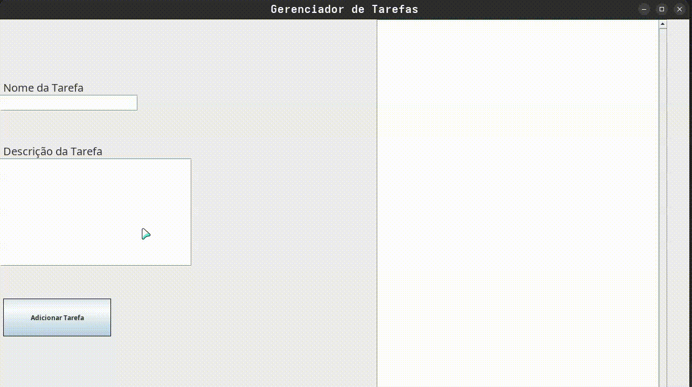

# Gerenciador de Tarefas
 


Um simples projeto de Adicionar e Remover Tarefas feito como exercício para aprendizado do modelode arquitetura MVC na linguagem Java.



## Sobre o projeto

O projeto foi desenvolvido inteiramente por mim como forma de estudo do modelo MVC sem conexão a banco de dados para focar na estrutura de diretórios e divisão de tarefas.

## Funcionalidades

- Adicionar Tarefa
- Remover Tarefa
- Checar Descrição da Tarefa
- Marcar como concluída

## Tecnologias utilizadas

- Intellij IDE
- OpenJDK 21
- Biblioteca java.utils
- Biblioteca javax.swing
- Biblioteca java.awt

## Como rodar o projeto

1. **Clone o repositório**
   ```bash
   git clone https://github.com/NevermoreRaven12/Gerenciador-de-Tarefas.git
   ```
2. **Navegue até o repistório**
   ```bash
   cd caminho-do-repositorio
   ```
3. Abra o projeto na sua IDE de preferência
4. Compile e rode o código através do arquivo *Main.java*

   Author: Pedro Cardoso
   
   Licença: MIT (checar LICENSE.md para mais detalhes)


